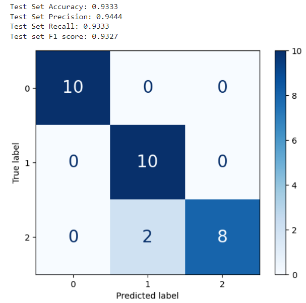
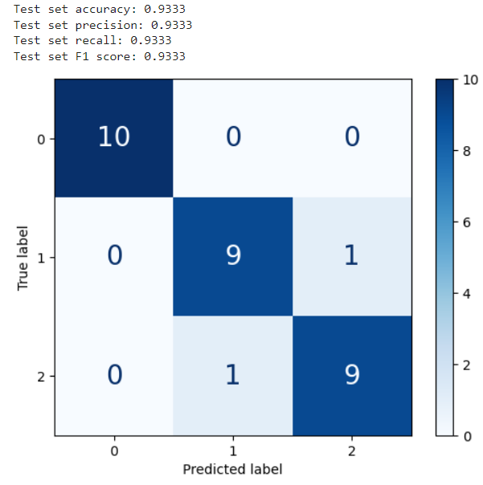
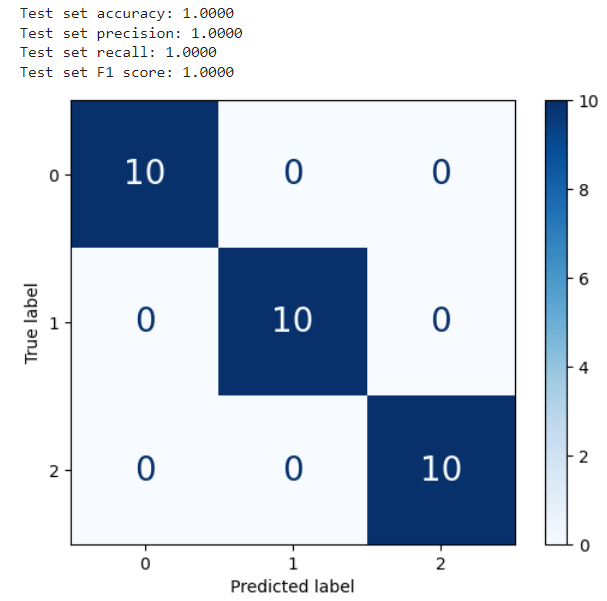
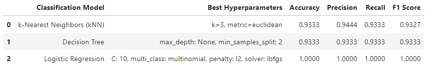

# Comparison of K-Nearest Neighbours, Decision Tree and Logistic Regression on Iris Plants Dataset
Machine Learning and Neural Network course project (July 2024)
 
<b>Project jupyter notebook: [mlnn.ipynb](mlnn.ipynb)</b>

## Table of Contents
- [Introduction](#introduction)
- [Overview](#overview)
- [Dataset](#dataset)
- [Methadologies](#methadologies)
- [Results](#results)
- [Conclusion](#conclusion)
- [References and Resources](#references-and-resources)

## Introduction
This project conducts and compares the performance of three diferent machine learning classification algorithms, specifically K-Nearest Neighbours, Decision Tree and Logistic Regression on scikit-learn's Iris Plants dataset, aiming to provide insights on which algorithm is more suitable for the task.

## Overview
The K-Nearest Neighbours algorithm is implemented from scratch, while Decision Tree and Logistic Regression are implemented using scikit-learn. The project starts with data preparation of the Iris plants dataset which involves train and test set splitting, feature scaling and t-SNE. Then, followed by exploratory data analysis (EDA), allowing us to understand our dataset through visualisation techniques such as histogram, pairplot and correlation matrix. Next is the machine learning model implementations (KNN, Decision Tree, Logistic Regression). Hyperparameter tuning utilising cross-validation was conducted to find the best hyperparameters for the models, followed by model evaluation using metrics such as confusion matrix, accuracy, precision, recall and F1 score. Logistic Regression produced 100% accuracy, precision, recall, and F1 score on the test set. Lastly, the project compares the model’s performances and discusses each of their strengths and weaknesses.

## Dataset
For this project, we will be using scikit-learn's 'Iris Plants Dataset'. is is a standard and widely used dataset for experimenting with aspects of machine learning, in this case the comparison of three diferent algorithms on a chosen dataset. This dataset is chosen due to its small size and simplicity which is suitable for comparison of diferent algorithms on a chosen dataset. Furthermore, the toy datasets from scikit-learn are preprocessed, simplifying the implementations of this project.

## Methadologies
The following methadologies are used in this project:
- Train, and Test Set Splitting
- Feature Scaling: scikit-learn's StandardScalar
- t-SNE
- Grid Search
- Cross Validation
- Model Evaluation Metric: Confusion Matrix, Accuracy, Precision, Recall, F1 score

## Results
<b>K-Nearest Neighbours:</b>
 
 

 

<b>Decision Tree:</b>
 
 

 

<b>Logistic Regression:</b>
 
 

 
 

<b>Consolidated Results:</b>
 
 

 
 

From the results, K-Nearest Neighbours's evaluation metrics showed a 93.33% accuracy and recall, 94.44% for precision and 93.27% for F1 score, indicating that it did generally well classifying the Iris Plants dataset. Since KNN is a lazy learner, it is easy to understand and implement. However, one weakness is that since it uses distance metric in its algorithm, it may be computationally expensive for larger datasets.

For Decision Tree, it has a 93.33% for all 4 evaluation metrics. It shows that it does generally well in classifying the Iris Plants dataset as well. It does not require feature scaling however, it relies significantly on having good hyperparameters to produce accurate results and is sensitive to changes in the data.

Lastly, Logistic Regression does exceptionally well in classifying the Iris Plants dataset, obtaining a 100% on all 4 evaluation metrics. This shows that Logistic Regression is a good choice for classifying the Iris Plants dataset. The hyperparameter l2 helps to prevent the model from overfitting, which may have contributed to the model's good performance. Feature scaling had been applied to the dataset which could also contribute to the model's performance as it performs better with standardised features.

## Conclusion
Overall, KNN is simple to understand and implement but becomes computationally expensive with larger datasets. Decision Tree offers interpretability but can become complex and prone to overfitting. Logistic Regression is outstanding with well-suited hyperparameters, but its sensitivity to hyperparameter and requirement for feature scaling add some complexity. As each model offers their own strengths and weaknesses, choosing which model to use for classification will depend on the dataset features and project requirement.

## References and Resources
### Dataset
- scikit-learn. (2024). The Iris Dataset [Online]. Available: https://scikit-learn.org/stable/auto_examples/datasets/plot_iris_dataset.html#sphx-glr-auto-examples-datasets-plot-iris-dataset-py
- Coursera Lecture 4.301 Cross-validation

### K-Nearest Neighbours
- 'Machine Learning: K-Nearest Neighbours Classification' Lecture slides by Dr Tarapong Sreenuch
- K-Nearest Neighbours Classification Github lecture materials by Dr Tarapong Sreenuch
- scikit-learn. (2024). 1.6. Nearest Neighbors [Online]. Available: https://scikit-learn.org/stable/modules/neighbors.html

### Decision Tree
- 'Exercise: Decision Trees in sklearn' Github lecture exercise by Dr Tarapong Sreenuch
- scikit-learn. (2024). 1.10. Decision Trees [Online]. Available: https://scikit-learn.org/stable/modules/tree.html
- scikit-learn. (2024). DecisionTreeClassifier [Online]. Available: https://scikit-learn.org/stable/modules/generated/sklearn.tree.DecisionTreeClassifier.html

### Logistic Regression
- scikit-learn. (2024). 1.1. Linear Models [Online]. Available: https://scikit-learn.org/stable/modules/linear_model.html#logistic-regression
- scikit-learn. (2024). LogisticRegression [Online]. Available: https://scikit-learn.org/stable/modules/generated/sklearn.linear_model.LogisticRegression.html

[def]: In
